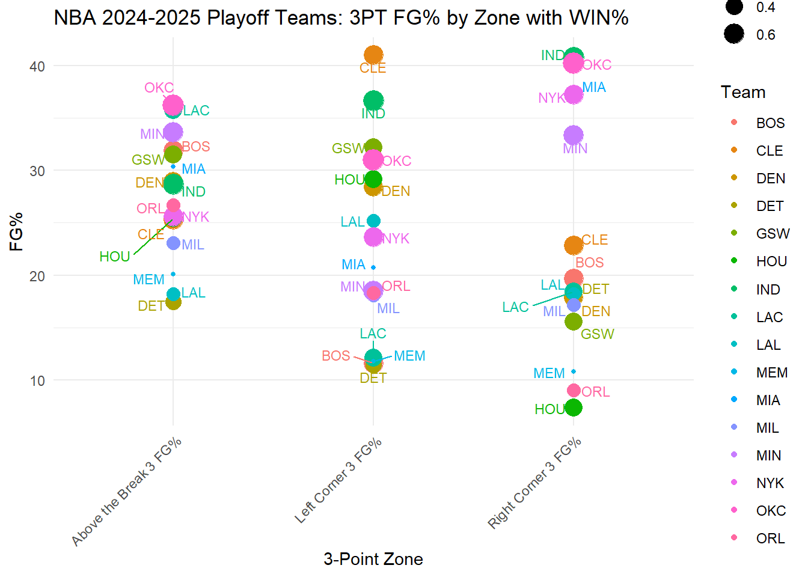
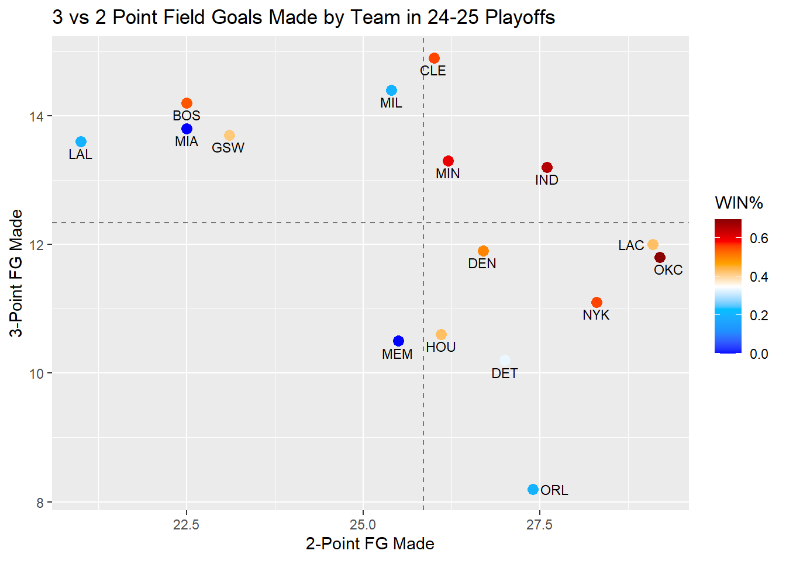
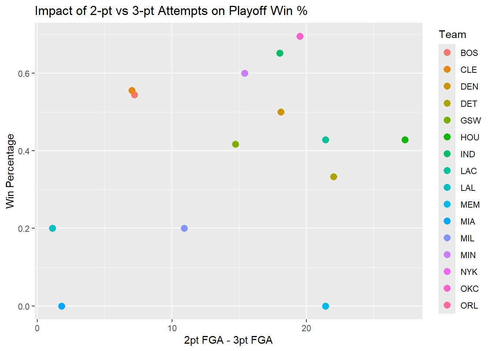

## Introduction
The NBA playoffs are defined by high-stakes matchups, rapidly shifting strategies, and the constant search for competitive advantages. As modern basketball increasingly emphasizes spacing and perimeter shooting, an important analytical question emerges: To what extent does three-point shooting influence playoff success compared to two-point efficiency? In this report, we analyze team-level and player-level data from the 2024–2025 NBA playoffs to investigate how shooting performance across different zones—such as corner threes, above-the-break threes, and shots in the paint—relates to win percentage and overall postseason success. We aim to determine whether three-point percentage is a stronger predictor of playoff performance than two-point percentage, and which specific shooting areas contribute most to winning. We theorize that three-point efficiency is a significantly stronger predictor of playoff success than two-point efficiency in modern day basketball and that specific high-value shooting zones—particularly corner and above-the-break threes—provide meaningful competitive advantages for teams in the 2024–2025 NBA playoffs.

## Background
The two data sets being analyzed are from the official NBA Statistics website, in which data has been meticulously collected over the past several decades. The data is exclusively limited to playoff data, to disregard any intentional loosing for future draft picks, or other reasons, that teams my do in the regular season. There are two data sets that are being analyzed in this report, individual player shooting data that will be referred to as shooting_data, and team performance data that will be referred to as team_data. Both data sets are kept to strictly the 2024-25 Playoff season.

The shooting_data section looks at all players individual shooting statistics, averaged out per game in the playoffs. The columns include the player's name, team, age, and shooting statistics. Each section of shooting statistics comes with three areas: field goals made (FGM), field goals attempted (FGA), and field goal percentage (FG%). The data set contains these statistics for shots taken in different areas of the court. Areas:
- Restricted Area: Right under the basket, typically layups and dunks. Must be taken in the semi circle painted on the court under the basket.
- In the Paint (Non - RA): These are shots taken in the painted region of the basketball court, below the free throw line, not including Restricted Area shots. These can possibly be dunks or layups if a player jumps or reaches far enough.
- Mid-Range: These are shots taken inside of the three point line that do not fall under the previous two categories.
- Left-Corner 3: Shots taken beyond the 3 point line in the left corner of the court.
- Right-Corner 3:  Shots taken beyond the 3 point line in the right corner of the court.
- Corner 3: An aggregate of both Left and Right corner three point shots.
Above the Break 3: Shots taken beyond the 3 point line that do not consider corner shots, they are taken either directly in-line with the basket or at a partial angle.
- 3 and 2: Adjusted fields to get aggregate values for 2 and 3 point shooting.

The team_data section looks at each team's performance in the playoffs, and maintains a team column with each Team's abbreviated name. The columns that are being used in this analysis are WIN%, which is the winning percentage of a team, directly correlating to their success in the playoffs. There are also fields FGM, FGA, FG%, and 3PM, 3PA, 3P% which as in the shooting_data section look into team average shooting statistics per game, at the 2 and 3 point shot levels.

The data being analyzed does leave out certain players from teams that did not play impact, or any minutes. This is to remove players with no shooting data, or just one or two missed shots at the end of an already decided game. There are some unusualities in the data, in which NBA 3 point shooting has risen greatly over the last decade, teams simply put up more 3's, which has been noted as the key strategy of the 2023-24 NBA Playoff Championship Boston Celtics. In addition, there may be a correlation between 2 and 3 point shooting, and certain team strategies may have affected this. Shai Gilgeous-Alexander, the finals MVP and star play for the Championship winning Oklahoma City Thunder is known for driving inside the paint and attempting to draw fouls, for free shots and free throws at a rate higher than many other players. This strategy, if a foul is called, allows the player to either shoot two free throws for 2 points, or (if they make the basket), it counts and they can shoot one additional free throw, gaining the same amount of points as a 3-point shot would have made. Strategies to raise the expected value on any given play such as this are changing yearly in the NBA, and thus 3-point shooting is on the rise. Other discrepancies note that "free shots", such as break away lay-ups and dunks (usually in the Restricted Area) are always two points, and with no defense are almost certain to go in the basket. These kinds of shots can swing momentum, and teams who accumulate them are essentially gaining free points throughout the game. As a result, data may show that this shot is influential in game outcome, while it is more of a defensive outcome from a player stealing a ball, rather than an offensive shot.

In the following of this report, we will delve into the specifics of this data set, analyzing how 3-point shooting affects a given team's chances to win in the 2024-25 NBA Playoffs. The analysis will inquire about the proportion of 3 vs 2 point shots, and how they affect a team's winning percentage. In addition we will look at specific 3-point shooting data, and determine where the most affective areas of the court are for teams winning this year. We will look at the analysis of this data to determine whether 3-point shooting is as decisive of a factor towards winning in the NBA playoffs as popular media makes it out to be.

## Analysis


``` r
## Analysis - Team 3PT Shooting by Zone

# Aggregate player-level data to team-level averages for 3PT zones
team_zone_avgs <- nba_24_25_playoff_shooting_data %>%
  group_by(Team) %>%
  summarise(
    `Left Corner 3 FG%` = mean(as.numeric(`Left Corner 3. FG%`), na.rm = TRUE),
    `Right Corner 3 FG%` = mean(as.numeric(`Right Corner 3. FG%`), na.rm = TRUE),
    `Above the Break 3 FG%` = mean(`Above the Break 3. FG%`, na.rm = TRUE)
  ) %>%
  pivot_longer(
    cols = c(`Left Corner 3 FG%`, `Right Corner 3 FG%`, `Above the Break 3 FG%`),
    names_to = "Zone",
    values_to = "FG_Percent"
  )
```

```
## Warning: There were 8 warnings in `summarise()`.
## The first warning was:
## ℹ In argument: `Left Corner 3 FG% = mean(as.numeric(`Left Corner 3. FG%`),
##   na.rm = TRUE)`.
## ℹ In group 8: `Team = "LAC"`.
## Caused by warning in `mean()`:
## ! NAs introduced by coercion
## ℹ Run `dplyr::last_dplyr_warnings()` to see the 7 remaining warnings.
```
This chunk of code is aggregating player-level three-point shooting data into team-level averages for the 2024–2025 NBA playoffs. Because our goal is to analyze how three-point shooting affects team win percentage and playoff success, we need a single shooting percentage per team per zone, rather than having multiple rows per player.


``` r
team_zone_avgs <- team_zone_avgs %>%
  left_join(nba_24_25_playoff_team_data %>% select(Team, `WIN%`), by = "Team")
# Scatter plot with size proportional to WIN%
ggplot(team_zone_avgs, aes(x = Zone, y = FG_Percent, color = Team, size = `WIN%`)) +
  geom_point() +
  geom_text_repel(aes(label = Team), vjust = -0.5, size = 3, show.legend = FALSE) +
  labs(
    title = "NBA 2024-2025 Playoff Teams: 3PT FG% by Zone with WIN%",
    x = "3-Point Zone",
    y = "FG%",
    size = "Win %"
  ) +
  theme_minimal() +
  theme(axis.text.x = element_text(angle = 45, hjust = 1))
```



``` r
# This code builds on the previous team-level aggregation of three-point shooting percentages and creates a scatter plot visualizing 3PT shooting performance by zone for each playoff team, while also showing team success (win percentage) as the size of the points.((0.2%-Smallest sized point), (0.4% - Medium sized point) (0.6%-Large sized point))
```
After these graphing results we infer that the right corner three should be the strongest indicator to a teams success as both OKC and IND made it to the finals and both rank the highest on the right corner three FG%.

``` r
# Make sure team averages and WIN% are joined
team_zone_avgs <- nba_24_25_playoff_shooting_data %>%
  group_by(Team) %>%
  summarise(
    Left_Corner_3_FG = mean(as.numeric(`Left Corner 3. FG%`), na.rm = TRUE),
    Right_Corner_3_FG = mean(as.numeric(`Right Corner 3. FG%`), na.rm = TRUE),
    Above_the_Break_3_FG = mean(`Above the Break 3. FG%`, na.rm = TRUE)
  ) %>%
  left_join(nba_24_25_playoff_team_data %>% select(Team, `WIN%`), by = "Team")
```

```
## Warning: There were 8 warnings in `summarise()`.
## The first warning was:
## ℹ In argument: `Left_Corner_3_FG = mean(as.numeric(`Left Corner 3. FG%`), na.rm
##   = TRUE)`.
## ℹ In group 8: `Team = "LAC"`.
## Caused by warning in `mean()`:
## ! NAs introduced by coercion
## ℹ Run `dplyr::last_dplyr_warnings()` to see the 7 remaining warnings.
```

``` r
# Correlation tests for each zone
cor_left <- cor.test(team_zone_avgs$Left_Corner_3_FG, team_zone_avgs$`WIN%`)
cor_right <- cor.test(team_zone_avgs$Right_Corner_3_FG, team_zone_avgs$`WIN%`)
cor_above <- cor.test(team_zone_avgs$Above_the_Break_3_FG, team_zone_avgs$`WIN%`)
cor_left
```

```
## 
## 	Pearson's product-moment correlation
## 
## data:  team_zone_avgs$Left_Corner_3_FG and team_zone_avgs$`WIN%`
## t = 1.9832, df = 14, p-value = 0.06732
## alternative hypothesis: true correlation is not equal to 0
## 95 percent confidence interval:
##  -0.03567938  0.78238802
## sample estimates:
##       cor 
## 0.4683087
```

``` r
cor_right
```

```
## 
## 	Pearson's product-moment correlation
## 
## data:  team_zone_avgs$Right_Corner_3_FG and team_zone_avgs$`WIN%`
## t = 1.8329, df = 14, p-value = 0.08817
## alternative hypothesis: true correlation is not equal to 0
## 95 percent confidence interval:
##  -0.07135323  0.76811658
## sample estimates:
##       cor 
## 0.4399119
```

``` r
cor_above
```

```
## 
## 	Pearson's product-moment correlation
## 
## data:  team_zone_avgs$Above_the_Break_3_FG and team_zone_avgs$`WIN%`
## t = 2.2866, df = 14, p-value = 0.03831
## alternative hypothesis: true correlation is not equal to 0
## 95 percent confidence interval:
##  0.0347359 0.8082434
## sample estimates:
##       cor 
## 0.5214623
```
- Among the three-point zones, only above-the-break three-point shooting shows a statistically significant correlation with playoff win percentage (r ≈ 0.52, p ≈ 0.038), while corner threes, though positively correlated, are not statistically significant.


``` r
#put data into SharedData so that graph can be interactive
nba_shared_data <- SharedData$new(nba_sum, key = ~Team, group = "NBA_Data")


nba_3v2FGM_plot <- nba_shared_data %>%
  ggplot(aes(x = `2 FGM`, y = `3 FGM`)) +
  geom_point(size = 3, aes(color = `WIN%`, text = paste("Team:", Team, "\nWin %:",`WIN%`, "\nPlayer:", Player))) + 
  scale_color_gradientn(
    colors = c("blue", "dodgerblue","deepskyblue", "white", "orange", "red", "darkred")
  ) + 
  geom_vline(xintercept = mean(nba_sum$`2 FGM`), linetype = "dashed", alpha = 0.5) +
  geom_hline(yintercept = mean(nba_sum$`3 FGM`), linetype = "dashed", alpha = 0.5) +
  labs(
    y = "3-Point FG Made", x = "2-Point FG Made", title = "3 vs 2 Point Field Goals Made, Win% Gradient in 24-25 Playoffs"
    )
```

```
## Warning in geom_point(size = 3, aes(color = `WIN%`, text = paste("Team:", :
## Ignoring unknown aesthetics: text
```

``` r
interactive <- ggplotly(nba_3v2FGM_plot, tooltip = c("text", "x", "y"))

team_filter <- filter_select(
  id = "team_select",
  label = "Select Team:",
  sharedData = nba_shared_data,
  group = ~Team,
  allLevels = TRUE
)

browsable(
  tagList(
    team_filter,
    interactive
  )
)
```

```{=html}
<div id="team_select" class="form-group crosstalk-input-select crosstalk-input">
<label class="control-label" for="team_select">Select Team:</label>
<div>
<select multiple></select>
<script type="application/json" data-for="team_select">{
  "items": {
    "value": ["BOS", "CLE", "DEN", "DET", "GSW", "HOU", "IND", "LAC", "LAL", "MEM", "MIA", "MIL", "MIN", "NYK", "OKC", "ORL"],
    "label": ["BOS", "CLE", "DEN", "DET", "GSW", "HOU", "IND", "LAC", "LAL", "MEM", "MIA", "MIL", "MIN", "NYK", "OKC", "ORL"]
  },
  "map": {
    "BOS": ["BOS", "BOS", "BOS", "BOS", "BOS", "BOS"],
    "CLE": ["CLE", "CLE", "CLE", "CLE", "CLE", "CLE"],
    "DEN": ["DEN", "DEN", "DEN", "DEN", "DEN", "DEN"],
    "DET": ["DET", "DET", "DET", "DET", "DET", "DET"],
    "GSW": ["GSW", "GSW", "GSW", "GSW", "GSW", "GSW"],
    "HOU": ["HOU", "HOU", "HOU", "HOU", "HOU", "HOU"],
    "IND": ["IND", "IND", "IND", "IND", "IND", "IND"],
    "LAC": ["LAC", "LAC", "LAC", "LAC", "LAC", "LAC"],
    "LAL": ["LAL", "LAL", "LAL", "LAL", "LAL", "LAL"],
    "MEM": ["MEM", "MEM", "MEM", "MEM", "MEM", "MEM"],
    "MIA": ["MIA", "MIA", "MIA", "MIA", "MIA", "MIA"],
    "MIL": ["MIL", "MIL", "MIL", "MIL", "MIL", "MIL"],
    "MIN": ["MIN", "MIN", "MIN", "MIN", "MIN", "MIN"],
    "NYK": ["NYK", "NYK", "NYK", "NYK", "NYK", "NYK"],
    "OKC": ["OKC", "OKC", "OKC", "OKC", "OKC", "OKC"],
    "ORL": ["ORL", "ORL", "ORL", "ORL", "ORL", "ORL"]
  },
  "group": ["NBA_Data"]
}</script>
</div>
</div>
<div class="plotly html-widget html-fill-item" id="htmlwidget-0a18e98dc6efc0b514ec" style="width:100%;height:400px;"></div>
<script type="application/json" data-for="htmlwidget-0a18e98dc6efc0b514ec">{"x":{"data":[{"x":[5.6999999999999993,5.8999999999999995,2.5,1.7,2.5,2,6.3999999999999995,3.8000000000000003,4.5999999999999996,2.5,1.2000000000000002,1.8999999999999999,7.5,5.5,4.2000000000000002,3.3000000000000003,2.5,1.6000000000000001,8.3000000000000007,1.3999999999999999,4,1.3999999999999999,2.7000000000000002,4,3.7999999999999998,5.1000000000000005,4.4000000000000004,2.2000000000000002,1.6000000000000001,2.2000000000000002,7.9999999999999991,1.8999999999999999,2.6000000000000001,5.7999999999999998,2.6000000000000001,1.9000000000000001,6.0999999999999996,4.0999999999999996,2.7999999999999998,3.1999999999999997,1.7000000000000002,3.7999999999999998,7.3000000000000007,4,4,7.6999999999999993,2.1000000000000001,1,6.1999999999999993,6.5999999999999996,2.9999999999999996,2.6000000000000001,1,1,6.1000000000000005,4.7999999999999998,3.0999999999999996,2.7999999999999998,2,0.40000000000000002,4.5999999999999996,5.3999999999999995,2.2999999999999998,4.5999999999999996,2,1.1000000000000001,11.800000000000001,4,2,2.4000000000000004,0.89999999999999991,0,5.9000000000000004,5.5999999999999996,4.4000000000000004,1.2000000000000002,1.5,2.1000000000000001,7.4000000000000004,6.3000000000000007,5.0999999999999996,3.3999999999999999,2.8000000000000003,0.69999999999999996,8.6999999999999993,6.1999999999999993,4.2000000000000002,0.5,1.6000000000000001,3.5,8.4000000000000004,8.8000000000000007,3.2999999999999998,3.5999999999999996,2.6000000000000001,1],"y":[3.6000000000000001,2,3.6000000000000001,2.5,1.1000000000000001,0.40000000000000002,3.1000000000000001,2,1.8,1.5,2.9000000000000004,1.5,2,2.3999999999999999,1.5,1.5,1.5,1.7999999999999998,0.80000000000000004,3.4000000000000004,1.7,2.5999999999999996,1.6000000000000001,0,4,1,1.3,1.9000000000000001,2.7999999999999998,1.3,0.40000000000000002,3.7999999999999998,1.8,0.10000000000000001,1.3999999999999999,1,1.5,2.3000000000000003,1.7,1.3,2.6000000000000001,0.30000000000000004,2.2000000000000002,2.2999999999999998,2,0,0.79999999999999993,1.5,3.2000000000000002,2,3,3,1.3999999999999999,0.5,1.3,0.80000000000000004,2.5,2.6000000000000001,0,1.2000000000000002,2.2999999999999998,1.8,1.8,1.8,1.6000000000000001,1.8,0.20000000000000001,2,4.4000000000000004,1.3999999999999999,1,3.5999999999999996,3.1000000000000001,2,1.3999999999999999,1.9000000000000001,1.5,1.7,2.7000000000000002,1.5,1.5,2.2000000000000002,1.1000000000000001,1.2999999999999998,1.3,1.6000000000000001,1.1000000000000001,2.1000000000000001,1.6000000000000001,0,2.3999999999999999,1.3999999999999999,1.8,0.60000000000000009,0.40000000000000002,1],"text":["2 FGM:  5.7<br />3 FGM: 3.6<br />Team: BOS <br />Win %: 0.545 <br />Player: Jayson Tatum","2 FGM:  5.9<br />3 FGM: 2.0<br />Team: BOS <br />Win %: 0.545 <br />Player: Jaylen Brown","2 FGM:  2.5<br />3 FGM: 3.6<br />Team: BOS <br />Win %: 0.545 <br />Player: Derrick White","2 FGM:  1.7<br />3 FGM: 2.5<br />Team: BOS <br />Win %: 0.545 <br />Player: Payton Pritchard","2 FGM:  2.5<br />3 FGM: 1.1<br />Team: BOS <br />Win %: 0.545 <br />Player: Jrue Holiday","2 FGM:  2.0<br />3 FGM: 0.4<br />Team: BOS <br />Win %: 0.545 <br />Player: Kristaps Porziņģis","2 FGM:  6.4<br />3 FGM: 3.1<br />Team: CLE <br />Win %: 0.556 <br />Player: Donovan Mitchell","2 FGM:  3.8<br />3 FGM: 2.0<br />Team: CLE <br />Win %: 0.556 <br />Player: Darius Garland","2 FGM:  4.6<br />3 FGM: 1.8<br />Team: CLE <br />Win %: 0.556 <br />Player: Evan Mobley","2 FGM:  2.5<br />3 FGM: 1.5<br />Team: CLE <br />Win %: 0.556 <br />Player: Ty Jerome","2 FGM:  1.2<br />3 FGM: 2.9<br />Team: CLE <br />Win %: 0.556 <br />Player: Max Strus","2 FGM:  1.9<br />3 FGM: 1.5<br />Team: CLE <br />Win %: 0.556 <br />Player: De'Andre Hunter","2 FGM:  7.5<br />3 FGM: 2.0<br />Team: DEN <br />Win %: 0.5 <br />Player: Nikola Jokić","2 FGM:  5.5<br />3 FGM: 2.4<br />Team: DEN <br />Win %: 0.5 <br />Player: Jamal Murray","2 FGM:  4.2<br />3 FGM: 1.5<br />Team: DEN <br />Win %: 0.5 <br />Player: Aaron Gordon","2 FGM:  3.3<br />3 FGM: 1.5<br />Team: DEN <br />Win %: 0.5 <br />Player: Christian Braun","2 FGM:  2.5<br />3 FGM: 1.5<br />Team: DEN <br />Win %: 0.5 <br />Player: Russell Westbrook","2 FGM:  1.6<br />3 FGM: 1.8<br />Team: DEN <br />Win %: 0.5 <br />Player: Michael Porter Jr.","2 FGM:  8.3<br />3 FGM: 0.8<br />Team: DET <br />Win %: 0.333 <br />Player: Cade Cunningham","2 FGM:  1.4<br />3 FGM: 3.4<br />Team: DET <br />Win %: 0.333 <br />Player: Malik Beasley","2 FGM:  4.0<br />3 FGM: 1.7<br />Team: DET <br />Win %: 0.333 <br />Player: Tobias Harris","2 FGM:  1.4<br />3 FGM: 2.6<br />Team: DET <br />Win %: 0.333 <br />Player: Tim Hardaway Jr.","2 FGM:  2.7<br />3 FGM: 1.6<br />Team: DET <br />Win %: 0.333 <br />Player: Dennis Schröder","2 FGM:  4.0<br />3 FGM: 0.0<br />Team: DET <br />Win %: 0.333 <br />Player: Ausar Thompson","2 FGM:  3.8<br />3 FGM: 4.0<br />Team: GSW <br />Win %: 0.417 <br />Player: Stephen Curry","2 FGM:  5.1<br />3 FGM: 1.0<br />Team: GSW <br />Win %: 0.417 <br />Player: Jimmy Butler III","2 FGM:  4.4<br />3 FGM: 1.3<br />Team: GSW <br />Win %: 0.417 <br />Player: Jonathan Kuminga","2 FGM:  2.2<br />3 FGM: 1.9<br />Team: GSW <br />Win %: 0.417 <br />Player: Brandin Podziemski","2 FGM:  1.6<br />3 FGM: 2.8<br />Team: GSW <br />Win %: 0.417 <br />Player: Buddy Hield","2 FGM:  2.2<br />3 FGM: 1.3<br />Team: GSW <br />Win %: 0.417 <br />Player: Draymond Green","2 FGM:  8.0<br />3 FGM: 0.4<br />Team: HOU <br />Win %: 0.429 <br />Player: Alperen Sengun","2 FGM:  1.9<br />3 FGM: 3.8<br />Team: HOU <br />Win %: 0.429 <br />Player: Fred VanVleet","2 FGM:  2.6<br />3 FGM: 1.8<br />Team: HOU <br />Win %: 0.429 <br />Player: Jalen Green","2 FGM:  5.8<br />3 FGM: 0.1<br />Team: HOU <br />Win %: 0.429 <br />Player: Amen Thompson","2 FGM:  2.6<br />3 FGM: 1.4<br />Team: HOU <br />Win %: 0.429 <br />Player: Dillon Brooks","2 FGM:  1.9<br />3 FGM: 1.0<br />Team: HOU <br />Win %: 0.429 <br />Player: Tari Eason","2 FGM:  6.1<br />3 FGM: 1.5<br />Team: IND <br />Win %: 0.652 <br />Player: Pascal Siakam","2 FGM:  4.1<br />3 FGM: 2.3<br />Team: IND <br />Win %: 0.652 <br />Player: Tyrese Haliburton","2 FGM:  2.8<br />3 FGM: 1.7<br />Team: IND <br />Win %: 0.652 <br />Player: Andrew Nembhard","2 FGM:  3.2<br />3 FGM: 1.3<br />Team: IND <br />Win %: 0.652 <br />Player: Myles Turner","2 FGM:  1.7<br />3 FGM: 2.6<br />Team: IND <br />Win %: 0.652 <br />Player: Aaron Nesmith","2 FGM:  3.8<br />3 FGM: 0.3<br />Team: IND <br />Win %: 0.652 <br />Player: T.J. McConnell","2 FGM:  7.3<br />3 FGM: 2.2<br />Team: LAC <br />Win %: 0.429 <br />Player: Kawhi Leonard","2 FGM:  4.0<br />3 FGM: 2.3<br />Team: LAC <br />Win %: 0.429 <br />Player: James Harden","2 FGM:  4.0<br />3 FGM: 2.0<br />Team: LAC <br />Win %: 0.429 <br />Player: Norman Powell","2 FGM:  7.7<br />3 FGM: 0.0<br />Team: LAC <br />Win %: 0.429 <br />Player: Ivica Zubac","2 FGM:  2.1<br />3 FGM: 0.8<br />Team: LAC <br />Win %: 0.429 <br />Player: Derrick Jones Jr.","2 FGM:  1.0<br />3 FGM: 1.5<br />Team: LAC <br />Win %: 0.429 <br />Player: Kris Dunn","2 FGM:  6.2<br />3 FGM: 3.2<br />Team: LAL <br />Win %: 0.2 <br />Player: Luka Dončić","2 FGM:  6.6<br />3 FGM: 2.0<br />Team: LAL <br />Win %: 0.2 <br />Player: LeBron James","2 FGM:  3.0<br />3 FGM: 3.0<br />Team: LAL <br />Win %: 0.2 <br />Player: Austin Reaves","2 FGM:  2.6<br />3 FGM: 3.0<br />Team: LAL <br />Win %: 0.2 <br />Player: Rui Hachimura","2 FGM:  1.0<br />3 FGM: 1.4<br />Team: LAL <br />Win %: 0.2 <br />Player: Dorian Finney-Smith","2 FGM:  1.0<br />3 FGM: 0.5<br />Team: LAL <br />Win %: 0.2 <br />Player: Dalton Knecht","2 FGM:  6.1<br />3 FGM: 1.3<br />Team: MEM <br />Win %: 0 <br />Player: Ja Morant","2 FGM:  4.8<br />3 FGM: 0.8<br />Team: MEM <br />Win %: 0 <br />Player: Jaren Jackson Jr.","2 FGM:  3.1<br />3 FGM: 2.5<br />Team: MEM <br />Win %: 0 <br />Player: Scotty Pippen Jr.","2 FGM:  2.8<br />3 FGM: 2.6<br />Team: MEM <br />Win %: 0 <br />Player: Santi Aldama","2 FGM:  2.0<br />3 FGM: 0.0<br />Team: MEM <br />Win %: 0 <br />Player: Lamar Stevens","2 FGM:  0.4<br />3 FGM: 1.2<br />Team: MEM <br />Win %: 0 <br />Player: Kentavious Caldwell-Pope","2 FGM:  4.6<br />3 FGM: 2.3<br />Team: MIA <br />Win %: 0 <br />Player: Tyler Herro","2 FGM:  5.4<br />3 FGM: 1.8<br />Team: MIA <br />Win %: 0 <br />Player: Bam Adebayo","2 FGM:  2.3<br />3 FGM: 1.8<br />Team: MIA <br />Win %: 0 <br />Player: Andrew Wiggins","2 FGM:  4.6<br />3 FGM: 1.8<br />Team: MIA <br />Win %: 0 <br />Player: Davion Mitchell","2 FGM:  2.0<br />3 FGM: 1.6<br />Team: MIA <br />Win %: 0 <br />Player: Nikola Jović","2 FGM:  1.1<br />3 FGM: 1.8<br />Team: MIA <br />Win %: 0 <br />Player: Haywood Highsmith","2 FGM: 11.8<br />3 FGM: 0.2<br />Team: MIL <br />Win %: 0.2 <br />Player: Giannis Antetokounmpo","2 FGM:  4.0<br />3 FGM: 2.0<br />Team: MIL <br />Win %: 0.2 <br />Player: Bobby Portis","2 FGM:  2.0<br />3 FGM: 4.4<br />Team: MIL <br />Win %: 0.2 <br />Player: Gary Trent Jr.","2 FGM:  2.4<br />3 FGM: 1.4<br />Team: MIL <br />Win %: 0.2 <br />Player: Kevin Porter Jr.","2 FGM:  0.9<br />3 FGM: 1.0<br />Team: MIL <br />Win %: 0.2 <br />Player: Damian Lillard","2 FGM:  0.0<br />3 FGM: 3.6<br />Team: MIL <br />Win %: 0.2 <br />Player: AJ Green","2 FGM:  5.9<br />3 FGM: 3.1<br />Team: MIN <br />Win %: 0.6 <br />Player: Anthony Edwards","2 FGM:  5.6<br />3 FGM: 2.0<br />Team: MIN <br />Win %: 0.6 <br />Player: Julius Randle","2 FGM:  4.4<br />3 FGM: 1.4<br />Team: MIN <br />Win %: 0.6 <br />Player: Jaden McDaniels","2 FGM:  1.2<br />3 FGM: 1.9<br />Team: MIN <br />Win %: 0.6 <br />Player: Donte DiVincenzo","2 FGM:  1.5<br />3 FGM: 1.5<br />Team: MIN <br />Win %: 0.6 <br />Player: Nickeil Alexander-Walker","2 FGM:  2.1<br />3 FGM: 1.7<br />Team: MIN <br />Win %: 0.6 <br />Player: Naz Reid","2 FGM:  7.4<br />3 FGM: 2.7<br />Team: NYK <br />Win %: 0.556 <br />Player: Jalen Brunson","2 FGM:  6.3<br />3 FGM: 1.5<br />Team: NYK <br />Win %: 0.556 <br />Player: Karl-Anthony Towns","2 FGM:  5.1<br />3 FGM: 1.5<br />Team: NYK <br />Win %: 0.556 <br />Player: Mikal Bridges","2 FGM:  3.4<br />3 FGM: 2.2<br />Team: NYK <br />Win %: 0.556 <br />Player: OG Anunoby","2 FGM:  2.8<br />3 FGM: 1.1<br />Team: NYK <br />Win %: 0.556 <br />Player: Josh Hart","2 FGM:  0.7<br />3 FGM: 1.3<br />Team: NYK <br />Win %: 0.556 <br />Player: Miles McBride","2 FGM:  8.7<br />3 FGM: 1.3<br />Team: OKC <br />Win %: 0.696 <br />Player: Shai Gilgeous-Alexander","2 FGM:  6.2<br />3 FGM: 1.6<br />Team: OKC <br />Win %: 0.696 <br />Player: Jalen Williams","2 FGM:  4.2<br />3 FGM: 1.1<br />Team: OKC <br />Win %: 0.696 <br />Player: Chet Holmgren","2 FGM:  0.5<br />3 FGM: 2.1<br />Team: OKC <br />Win %: 0.696 <br />Player: Luguentz Dort","2 FGM:  1.6<br />3 FGM: 1.6<br />Team: OKC <br />Win %: 0.696 <br />Player: Alex Caruso","2 FGM:  3.5<br />3 FGM: 0.0<br />Team: OKC <br />Win %: 0.696 <br />Player: Isaiah Hartenstein","2 FGM:  8.4<br />3 FGM: 2.4<br />Team: ORL <br />Win %: 0.2 <br />Player: Paolo Banchero","2 FGM:  8.8<br />3 FGM: 1.4<br />Team: ORL <br />Win %: 0.2 <br />Player: Franz Wagner","2 FGM:  3.3<br />3 FGM: 1.8<br />Team: ORL <br />Win %: 0.2 <br />Player: Desmond Bane","2 FGM:  3.6<br />3 FGM: 0.6<br />Team: ORL <br />Win %: 0.2 <br />Player: Wendell Carter Jr.","2 FGM:  2.6<br />3 FGM: 0.4<br />Team: ORL <br />Win %: 0.2 <br />Player: Anthony Black","2 FGM:  1.0<br />3 FGM: 1.0<br />Team: ORL <br />Win %: 0.2 <br />Player: Cory Joseph"],"key":["BOS","BOS","BOS","BOS","BOS","BOS","CLE","CLE","CLE","CLE","CLE","CLE","DEN","DEN","DEN","DEN","DEN","DEN","DET","DET","DET","DET","DET","DET","GSW","GSW","GSW","GSW","GSW","GSW","HOU","HOU","HOU","HOU","HOU","HOU","IND","IND","IND","IND","IND","IND","LAC","LAC","LAC","LAC","LAC","LAC","LAL","LAL","LAL","LAL","LAL","LAL","MEM","MEM","MEM","MEM","MEM","MEM","MIA","MIA","MIA","MIA","MIA","MIA","MIL","MIL","MIL","MIL","MIL","MIL","MIN","MIN","MIN","MIN","MIN","MIN","NYK","NYK","NYK","NYK","NYK","NYK","OKC","OKC","OKC","OKC","OKC","OKC","ORL","ORL","ORL","ORL","ORL","ORL"],"type":"scatter","mode":"markers","marker":{"autocolorscale":false,"color":["rgba(255,84,0,1)","rgba(255,84,0,1)","rgba(255,84,0,1)","rgba(255,84,0,1)","rgba(255,84,0,1)","rgba(255,84,0,1)","rgba(255,68,0,1)","rgba(255,68,0,1)","rgba(255,68,0,1)","rgba(255,68,0,1)","rgba(255,68,0,1)","rgba(255,68,0,1)","rgba(255,132,0,1)","rgba(255,132,0,1)","rgba(255,132,0,1)","rgba(255,132,0,1)","rgba(255,132,0,1)","rgba(255,132,0,1)","rgba(235,247,255,1)","rgba(235,247,255,1)","rgba(235,247,255,1)","rgba(235,247,255,1)","rgba(235,247,255,1)","rgba(235,247,255,1)","rgba(255,201,124,1)","rgba(255,201,124,1)","rgba(255,201,124,1)","rgba(255,201,124,1)","rgba(255,201,124,1)","rgba(255,201,124,1)","rgba(255,191,100,1)","rgba(255,191,100,1)","rgba(255,191,100,1)","rgba(255,191,100,1)","rgba(255,191,100,1)","rgba(255,191,100,1)","rgba(181,0,2,1)","rgba(181,0,2,1)","rgba(181,0,2,1)","rgba(181,0,2,1)","rgba(181,0,2,1)","rgba(181,0,2,1)","rgba(255,191,100,1)","rgba(255,191,100,1)","rgba(255,191,100,1)","rgba(255,191,100,1)","rgba(255,191,100,1)","rgba(255,191,100,1)","rgba(21,178,255,1)","rgba(21,178,255,1)","rgba(21,178,255,1)","rgba(21,178,255,1)","rgba(21,178,255,1)","rgba(21,178,255,1)","rgba(0,0,255,1)","rgba(0,0,255,1)","rgba(0,0,255,1)","rgba(0,0,255,1)","rgba(0,0,255,1)","rgba(0,0,255,1)","rgba(0,0,255,1)","rgba(0,0,255,1)","rgba(0,0,255,1)","rgba(0,0,255,1)","rgba(0,0,255,1)","rgba(0,0,255,1)","rgba(21,178,255,1)","rgba(21,178,255,1)","rgba(21,178,255,1)","rgba(21,178,255,1)","rgba(21,178,255,1)","rgba(21,178,255,1)","rgba(234,0,1,1)","rgba(234,0,1,1)","rgba(234,0,1,1)","rgba(234,0,1,1)","rgba(234,0,1,1)","rgba(234,0,1,1)","rgba(255,68,0,1)","rgba(255,68,0,1)","rgba(255,68,0,1)","rgba(255,68,0,1)","rgba(255,68,0,1)","rgba(255,68,0,1)","rgba(139,0,0,1)","rgba(139,0,0,1)","rgba(139,0,0,1)","rgba(139,0,0,1)","rgba(139,0,0,1)","rgba(139,0,0,1)","rgba(21,178,255,1)","rgba(21,178,255,1)","rgba(21,178,255,1)","rgba(21,178,255,1)","rgba(21,178,255,1)","rgba(21,178,255,1)"],"opacity":1,"size":11.338582677165356,"symbol":"circle","line":{"width":1.8897637795275593,"color":["rgba(255,84,0,1)","rgba(255,84,0,1)","rgba(255,84,0,1)","rgba(255,84,0,1)","rgba(255,84,0,1)","rgba(255,84,0,1)","rgba(255,68,0,1)","rgba(255,68,0,1)","rgba(255,68,0,1)","rgba(255,68,0,1)","rgba(255,68,0,1)","rgba(255,68,0,1)","rgba(255,132,0,1)","rgba(255,132,0,1)","rgba(255,132,0,1)","rgba(255,132,0,1)","rgba(255,132,0,1)","rgba(255,132,0,1)","rgba(235,247,255,1)","rgba(235,247,255,1)","rgba(235,247,255,1)","rgba(235,247,255,1)","rgba(235,247,255,1)","rgba(235,247,255,1)","rgba(255,201,124,1)","rgba(255,201,124,1)","rgba(255,201,124,1)","rgba(255,201,124,1)","rgba(255,201,124,1)","rgba(255,201,124,1)","rgba(255,191,100,1)","rgba(255,191,100,1)","rgba(255,191,100,1)","rgba(255,191,100,1)","rgba(255,191,100,1)","rgba(255,191,100,1)","rgba(181,0,2,1)","rgba(181,0,2,1)","rgba(181,0,2,1)","rgba(181,0,2,1)","rgba(181,0,2,1)","rgba(181,0,2,1)","rgba(255,191,100,1)","rgba(255,191,100,1)","rgba(255,191,100,1)","rgba(255,191,100,1)","rgba(255,191,100,1)","rgba(255,191,100,1)","rgba(21,178,255,1)","rgba(21,178,255,1)","rgba(21,178,255,1)","rgba(21,178,255,1)","rgba(21,178,255,1)","rgba(21,178,255,1)","rgba(0,0,255,1)","rgba(0,0,255,1)","rgba(0,0,255,1)","rgba(0,0,255,1)","rgba(0,0,255,1)","rgba(0,0,255,1)","rgba(0,0,255,1)","rgba(0,0,255,1)","rgba(0,0,255,1)","rgba(0,0,255,1)","rgba(0,0,255,1)","rgba(0,0,255,1)","rgba(21,178,255,1)","rgba(21,178,255,1)","rgba(21,178,255,1)","rgba(21,178,255,1)","rgba(21,178,255,1)","rgba(21,178,255,1)","rgba(234,0,1,1)","rgba(234,0,1,1)","rgba(234,0,1,1)","rgba(234,0,1,1)","rgba(234,0,1,1)","rgba(234,0,1,1)","rgba(255,68,0,1)","rgba(255,68,0,1)","rgba(255,68,0,1)","rgba(255,68,0,1)","rgba(255,68,0,1)","rgba(255,68,0,1)","rgba(139,0,0,1)","rgba(139,0,0,1)","rgba(139,0,0,1)","rgba(139,0,0,1)","rgba(139,0,0,1)","rgba(139,0,0,1)","rgba(21,178,255,1)","rgba(21,178,255,1)","rgba(21,178,255,1)","rgba(21,178,255,1)","rgba(21,178,255,1)","rgba(21,178,255,1)"]}},"hoveron":"points","set":"NBA_Data","showlegend":false,"xaxis":"x","yaxis":"y","hoverinfo":"text","_isNestedKey":false,"frame":null},{"x":[3.7135416666666665,3.7135416666666665],"y":[-0.22000000000000003,4.6200000000000001],"text":"","type":"scatter","mode":"lines","line":{"width":1.8897637795275593,"color":"rgba(0,0,0,0.5)","dash":"dash"},"hoveron":"points","showlegend":false,"xaxis":"x","yaxis":"y","hoverinfo":"text","frame":null},{"x":[-0.59000000000000008,12.390000000000001],"y":[1.7552083333333333,1.7552083333333333],"text":"","type":"scatter","mode":"lines","line":{"width":1.8897637795275593,"color":"rgba(0,0,0,0.5)","dash":"dash"},"hoveron":"points","showlegend":false,"xaxis":"x","yaxis":"y","hoverinfo":"text","frame":null},{"x":[0],"y":[0],"name":"04db2136c009ffc4985489e8c6b27f07","type":"scatter","mode":"markers","opacity":0,"hoverinfo":"skip","showlegend":false,"marker":{"color":[0,1],"colorscale":[[0,"#0000FF"],[0.0033444816053511705,"#060AFF"],[0.006688963210702341,"#0B12FF"],[0.010033444816053512,"#1018FF"],[0.013377926421404682,"#131DFF"],[0.016722408026755852,"#1621FF"],[0.020066889632107024,"#1925FF"],[0.023411371237458192,"#1B29FF"],[0.026755852842809364,"#1D2DFF"],[0.030100334448160539,"#1F30FF"],[0.033444816053511704,"#2133FF"],[0.03678929765886288,"#2236FF"],[0.040133779264214048,"#2439FF"],[0.043478260869565216,"#253CFF"],[0.046822742474916385,"#263FFF"],[0.05016722408026756,"#2742FF"],[0.053511705685618728,"#2844FF"],[0.056856187290969896,"#2947FF"],[0.060200668896321079,"#2A49FF"],[0.06354515050167224,"#2B4CFF"],[0.066889632107023408,"#2B4EFF"],[0.070234113712374591,"#2C51FF"],[0.073578595317725759,"#2D53FF"],[0.076923076923076927,"#2D56FF"],[0.080267558528428096,"#2D58FF"],[0.083612040133779264,"#2E5AFF"],[0.086956521739130432,"#2E5DFF"],[0.090301003344481615,"#2E5FFF"],[0.093645484949832769,"#2E61FF"],[0.096989966555183951,"#2F63FF"],[0.10033444816053512,"#2F66FF"],[0.10367892976588629,"#2F68FF"],[0.10702341137123746,"#2E6AFF"],[0.11036789297658864,"#2E6CFF"],[0.11371237458193979,"#2E6EFF"],[0.11705685618729098,"#2E71FF"],[0.12040133779264216,"#2D73FF"],[0.12374581939799331,"#2D75FF"],[0.12709030100334448,"#2C77FF"],[0.13043478260869568,"#2C79FF"],[0.13377926421404682,"#2B7BFF"],[0.13712374581939799,"#2A7DFF"],[0.14046822742474918,"#2980FF"],[0.14381270903010032,"#2882FF"],[0.14715719063545152,"#2784FF"],[0.15050167224080269,"#2686FF"],[0.15384615384615385,"#2588FF"],[0.15719063545150502,"#238AFF"],[0.16053511705685619,"#228CFF"],[0.16387959866220736,"#208EFF"],[0.16722408026755853,"#1E90FF"],[0.1705685618729097,"#1E91FF"],[0.17391304347826086,"#1E92FF"],[0.17725752508361206,"#1E93FF"],[0.18060200668896323,"#1F94FF"],[0.1839464882943144,"#1F95FF"],[0.18729096989966554,"#1F96FF"],[0.19063545150501671,"#1F97FF"],[0.1939799331103679,"#1F98FF"],[0.19732441471571907,"#1F99FF"],[0.20066889632107024,"#1F9AFF"],[0.20401337792642144,"#1F9BFF"],[0.20735785953177258,"#1F9BFF"],[0.21070234113712374,"#1F9CFF"],[0.21404682274247491,"#1E9DFF"],[0.21739130434782611,"#1E9EFF"],[0.22073578595317728,"#1E9FFF"],[0.22408026755852842,"#1EA0FF"],[0.22742474916387959,"#1EA1FF"],[0.23076923076923078,"#1EA2FF"],[0.23411371237458195,"#1DA3FF"],[0.23745819397993312,"#1DA4FF"],[0.24080267558528431,"#1DA5FF"],[0.24414715719063543,"#1DA6FF"],[0.24749163879598662,"#1CA7FF"],[0.25083612040133779,"#1CA8FF"],[0.25418060200668896,"#1BA9FF"],[0.25752508361204013,"#1BAAFF"],[0.26086956521739135,"#1AABFF"],[0.26421404682274247,"#1AABFF"],[0.26755852842809363,"#19ACFF"],[0.2709030100334448,"#19ADFF"],[0.27424749163879597,"#18AEFF"],[0.27759197324414719,"#18AFFF"],[0.28093645484949836,"#17B0FF"],[0.28428093645484948,"#16B1FF"],[0.28762541806020064,"#15B2FF"],[0.29096989966555187,"#14B3FF"],[0.29431438127090304,"#13B4FF"],[0.2976588628762542,"#12B5FF"],[0.30100334448160537,"#11B6FF"],[0.30434782608695654,"#10B7FF"],[0.30769230769230771,"#0FB8FF"],[0.31103678929765888,"#0DB9FF"],[0.31438127090301005,"#0CBAFF"],[0.31772575250836121,"#0ABBFF"],[0.32107023411371238,"#08BCFF"],[0.32441471571906355,"#06BCFF"],[0.32775919732441472,"#04BDFF"],[0.33110367892976589,"#01BEFF"],[0.33444816053511706,"#0EBFFF"],[0.33779264214046822,"#24C1FF"],[0.34113712374581939,"#32C2FF"],[0.34448160535117056,"#3CC3FF"],[0.34782608695652173,"#45C4FF"],[0.3511705685618729,"#4DC6FF"],[0.35451505016722412,"#54C7FF"],[0.35785953177257529,"#5BC8FF"],[0.36120401337792646,"#61C9FF"],[0.36454849498327763,"#66CBFF"],[0.3678929765886288,"#6CCCFF"],[0.37123745819397991,"#71CDFF"],[0.37458193979933108,"#76CFFF"],[0.37792642140468224,"#7BD0FF"],[0.38127090301003341,"#80D1FF"],[0.38461538461538464,"#84D2FF"],[0.38795986622073581,"#89D4FF"],[0.39130434782608697,"#8DD5FF"],[0.39464882943143814,"#91D6FF"],[0.39799331103678931,"#96D7FF"],[0.40133779264214048,"#9AD9FF"],[0.4046822742474917,"#9EDAFF"],[0.40802675585284287,"#A2DBFF"],[0.41137123745819393,"#A5DDFF"],[0.41471571906354515,"#A9DEFF"],[0.41806020066889632,"#ADDFFF"],[0.42140468227424749,"#B1E0FF"],[0.42474916387959866,"#B4E2FF"],[0.42809364548494983,"#B8E3FF"],[0.43143812709030099,"#BCE4FF"],[0.43478260869565222,"#BFE6FF"],[0.43812709030100339,"#C3E7FF"],[0.44147157190635455,"#C6E8FF"],[0.44481605351170572,"#C9E9FF"],[0.44816053511705684,"#CDEBFF"],[0.451505016722408,"#D0ECFF"],[0.45484949832775917,"#D4EDFF"],[0.45819397993311034,"#D7EFFF"],[0.46153846153846156,"#DAF0FF"],[0.46488294314381273,"#DEF1FF"],[0.4682274247491639,"#E1F3FF"],[0.47157190635451507,"#E4F4FF"],[0.47491638795986624,"#E7F5FF"],[0.47826086956521741,"#EAF6FF"],[0.48160535117056863,"#EEF8FF"],[0.4849498327759198,"#F1F9FF"],[0.48829431438127086,"#F4FAFF"],[0.49163879598662208,"#F7FCFF"],[0.49498327759197325,"#FAFDFF"],[0.49832775919732442,"#FDFEFF"],[0.50167224080267558,"#FFFEFD"],[0.50501672240802675,"#FFFCF8"],[0.50836120401337792,"#FFFAF4"],[0.51170568561872909,"#FFF8EF"],[0.51505016722408026,"#FFF7EB"],[0.51839464882943143,"#FFF5E6"],[0.52173913043478271,"#FFF3E2"],[0.52508361204013387,"#FFF1DD"],[0.52842809364548493,"#FFEFD9"],[0.5317725752508361,"#FFEDD5"],[0.53511705685618727,"#FFEBD0"],[0.53846153846153844,"#FFEACC"],[0.5418060200668896,"#FFE8C7"],[0.54515050167224077,"#FFE6C3"],[0.54849498327759194,"#FFE4BE"],[0.55183946488294322,"#FFE2BA"],[0.55518394648829439,"#FFE0B6"],[0.55852842809364556,"#FFDFB1"],[0.56187290969899673,"#FFDDAD"],[0.56521739130434778,"#FFDBA8"],[0.56856187290969895,"#FFD9A4"],[0.57190635451505012,"#FFD7A0"],[0.57525083612040129,"#FFD69B"],[0.57859531772575257,"#FFD497"],[0.58193979933110374,"#FFD292"],[0.5852842809364549,"#FFD08E"],[0.58862876254180607,"#FFCE8A"],[0.59197324414715724,"#FFCD85"],[0.59531772575250841,"#FFCB81"],[0.59866220735785958,"#FFC97C"],[0.60200668896321075,"#FFC778"],[0.6053511705685618,"#FFC573"],[0.60869565217391308,"#FFC46F"],[0.61204013377926425,"#FFC26A"],[0.61538461538461542,"#FFC066"],[0.61872909698996659,"#FFBE61"],[0.62207357859531776,"#FFBC5C"],[0.62541806020066892,"#FFBB58"],[0.62876254180602009,"#FFB953"],[0.63210702341137126,"#FFB74E"],[0.63545150501672243,"#FFB549"],[0.6387959866220736,"#FFB444"],[0.64214046822742477,"#FFB23F"],[0.64548494983277593,"#FFB039"],[0.6488294314381271,"#FFAE33"],[0.65217391304347827,"#FFAD2D"],[0.65551839464882944,"#FFAB26"],[0.65886287625418061,"#FFA91E"],[0.66220735785953178,"#FFA714"],[0.66555183946488294,"#FFA606"],[0.66889632107023411,"#FFA400"],[0.67224080267558528,"#FFA200"],[0.67558528428093645,"#FFA000"],[0.67892976588628773,"#FF9E00"],[0.68227424749163879,"#FF9B00"],[0.68561872909698995,"#FF9900"],[0.68896321070234112,"#FF9700"],[0.69230769230769229,"#FF9500"],[0.69565217391304346,"#FF9300"],[0.69899665551839463,"#FF9100"],[0.7023411371237458,"#FF8F00"],[0.70568561872909696,"#FF8D00"],[0.70903010033444824,"#FF8B00"],[0.71237458193979941,"#FF8800"],[0.71571906354515058,"#FF8600"],[0.71906354515050175,"#FF8400"],[0.72240802675585292,"#FF8200"],[0.72575250836120409,"#FF7F00"],[0.72909698996655525,"#FF7D00"],[0.73244147157190642,"#FF7B00"],[0.73578595317725759,"#FF7900"],[0.73913043478260876,"#FF7600"],[0.74247491638795982,"#FF7400"],[0.74581939799331098,"#FF7100"],[0.74916387959866215,"#FF6F00"],[0.75250836120401332,"#FF6D00"],[0.75585284280936449,"#FF6A00"],[0.75919732441471566,"#FF6700"],[0.76254180602006683,"#FF6500"],[0.76588628762541811,"#FF6200"],[0.76923076923076927,"#FF5F00"],[0.77257525083612044,"#FF5D00"],[0.77591973244147161,"#FF5A00"],[0.77926421404682278,"#FF5700"],[0.78260869565217395,"#FF5400"],[0.78595317725752512,"#FF5100"],[0.78929765886287628,"#FF4E00"],[0.79264214046822745,"#FF4B00"],[0.79598662207357862,"#FF4700"],[0.79933110367892979,"#FF4400"],[0.80267558528428096,"#FF4000"],[0.80602006688963224,"#FF3C00"],[0.8093645484949834,"#FF3800"],[0.81270903010033457,"#FF3300"],[0.81605351170568574,"#FF2F00"],[0.81939799331103669,"#FF2900"],[0.82274247491638786,"#FF2300"],[0.82608695652173914,"#FF1C00"],[0.8294314381270903,"#FF1200"],[0.83277591973244147,"#FF0300"],[0.83612040133779264,"#FD0000"],[0.83946488294314381,"#FB0000"],[0.84280936454849498,"#F80000"],[0.84615384615384615,"#F60000"],[0.84949832775919731,"#F30001"],[0.85284280936454848,"#F10001"],[0.85618729096989965,"#EE0001"],[0.85953177257525082,"#EC0001"],[0.86287625418060199,"#EA0001"],[0.86622073578595327,"#E70001"],[0.86956521739130443,"#E50001"],[0.8729096989966556,"#E20001"],[0.87625418060200677,"#E00001"],[0.87959866220735794,"#DE0001"],[0.88294314381270911,"#DB0001"],[0.88628762541806028,"#D90001"],[0.88963210702341144,"#D60002"],[0.89297658862876261,"#D40002"],[0.89632107023411367,"#D20002"],[0.89966555183946484,"#CF0002"],[0.90301003344481601,"#CD0002"],[0.90635451505016718,"#CB0002"],[0.90969899665551834,"#C80002"],[0.91304347826086951,"#C60002"],[0.91638795986622068,"#C40002"],[0.91973244147157185,"#C10002"],[0.92307692307692313,"#BF0002"],[0.9264214046822743,"#BD0002"],[0.92976588628762546,"#BA0002"],[0.93311036789297663,"#B80002"],[0.9364548494983278,"#B60002"],[0.93979933110367897,"#B30002"],[0.94314381270903014,"#B10002"],[0.94648829431438131,"#AF0002"],[0.94983277591973247,"#AC0002"],[0.95317725752508364,"#AA0002"],[0.95652173913043481,"#A80002"],[0.95986622073578598,"#A60002"],[0.96321070234113726,"#A30002"],[0.96655518394648843,"#A10002"],[0.9698996655518396,"#9F0002"],[0.97324414715719054,"#9D0002"],[0.97658862876254171,"#9A0001"],[0.97993311036789299,"#980001"],[0.98327759197324416,"#960001"],[0.98662207357859533,"#940001"],[0.98996655518394649,"#920001"],[0.99331103678929766,"#8F0000"],[0.99665551839464883,"#8D0000"],[1,"#8B0000"]],"colorbar":{"bgcolor":"rgba(255,255,255,1)","bordercolor":"transparent","borderwidth":0,"thickness":23.039999999999996,"title":"WIN%","titlefont":{"color":"rgba(0,0,0,1)","family":"","size":14.611872146118724},"tickmode":"array","ticktext":["0.0","0.2","0.4","0.6"],"tickvals":[0.0016666666666666668,0.28806513409961687,0.57446360153256715,0.86086206896551742],"tickfont":{"color":"rgba(0,0,0,1)","family":"","size":11.68949771689498},"ticklen":2,"len":0.5}},"xaxis":"x","yaxis":"y","frame":null}],"layout":{"margin":{"t":40.840182648401829,"r":7.3059360730593621,"b":37.260273972602747,"l":31.415525114155255},"plot_bgcolor":"rgba(235,235,235,1)","paper_bgcolor":"rgba(255,255,255,1)","font":{"color":"rgba(0,0,0,1)","family":"","size":14.611872146118724},"title":{"text":"3 vs 2 Point Field Goals Made, Win% Gradient in 24-25 Playoffs","font":{"color":"rgba(0,0,0,1)","family":"","size":17.534246575342465},"x":0,"xref":"paper"},"xaxis":{"domain":[0,1],"automargin":true,"type":"linear","autorange":false,"range":[-0.59000000000000008,12.390000000000001],"tickmode":"array","ticktext":["0","3","6","9","12"],"tickvals":[0,2.9999999999999991,6,9,12],"categoryorder":"array","categoryarray":["0","3","6","9","12"],"nticks":null,"ticks":"outside","tickcolor":"rgba(51,51,51,1)","ticklen":3.6529680365296811,"tickwidth":0,"showticklabels":true,"tickfont":{"color":"rgba(77,77,77,1)","family":"","size":11.68949771689498},"tickangle":-0,"showline":false,"linecolor":null,"linewidth":0,"showgrid":true,"gridcolor":"rgba(255,255,255,1)","gridwidth":0,"zeroline":false,"anchor":"y","title":{"text":"2-Point FG Made","font":{"color":"rgba(0,0,0,1)","family":"","size":14.611872146118724}},"hoverformat":".2f"},"yaxis":{"domain":[0,1],"automargin":true,"type":"linear","autorange":false,"range":[-0.22000000000000003,4.6200000000000001],"tickmode":"array","ticktext":["0","1","2","3","4"],"tickvals":[0,1,2,2.9999999999999996,3.9999999999999996],"categoryorder":"array","categoryarray":["0","1","2","3","4"],"nticks":null,"ticks":"outside","tickcolor":"rgba(51,51,51,1)","ticklen":3.6529680365296811,"tickwidth":0,"showticklabels":true,"tickfont":{"color":"rgba(77,77,77,1)","family":"","size":11.68949771689498},"tickangle":-0,"showline":false,"linecolor":null,"linewidth":0,"showgrid":true,"gridcolor":"rgba(255,255,255,1)","gridwidth":0,"zeroline":false,"anchor":"x","title":{"text":"3-Point FG Made","font":{"color":"rgba(0,0,0,1)","family":"","size":14.611872146118724}},"hoverformat":".2f"},"shapes":[{"type":"rect","fillcolor":null,"line":{"color":null,"width":0,"linetype":[]},"yref":"paper","xref":"paper","layer":"below","x0":0,"x1":1,"y0":0,"y1":1}],"showlegend":false,"legend":{"bgcolor":"rgba(255,255,255,1)","bordercolor":"transparent","borderwidth":0,"font":{"color":"rgba(0,0,0,1)","family":"","size":11.68949771689498},"title":{"text":"WIN%","font":{"color":"rgba(0,0,0,1)","family":"","size":14.611872146118724}}},"hovermode":"closest","barmode":"relative","dragmode":"zoom"},"config":{"doubleClick":"reset","modeBarButtonsToAdd":["hoverclosest","hovercompare"],"showSendToCloud":false},"source":"A","attrs":{"98187d366fa2":{"x":{},"y":{},"colour":{},"text":{},"type":"scatter"},"98184e6b69d7":{"xintercept":{}},"9818226d187":{"yintercept":{}}},"cur_data":"98187d366fa2","visdat":{"98187d366fa2":["function (y) ","x"],"98184e6b69d7":["function (y) ","x"],"9818226d187":["function (y) ","x"]},"highlight":{"on":"plotly_click","persistent":false,"dynamic":false,"selectize":false,"opacityDim":0.20000000000000001,"selected":{"opacity":1},"debounce":0,"ctGroups":["NBA_Data"]},"shinyEvents":["plotly_hover","plotly_click","plotly_selected","plotly_relayout","plotly_brushed","plotly_brushing","plotly_clickannotation","plotly_doubleclick","plotly_deselect","plotly_afterplot","plotly_sunburstclick"],"base_url":"https://plot.ly"},"evals":[],"jsHooks":[]}</script>
```


``` r
nba_24_25_playoff_team_data %>%
  ggplot(aes(x = `FGM`-`3PM`, y = `3PM`)) +
  geom_point(size = 3, aes(color = `WIN%`)) + 
  scale_color_gradientn(
    colors = c("blue", "dodgerblue","deepskyblue", "white", "orange", "red", "darkred")
  ) + 
  geom_text_repel(aes(label = Team), vjust = -0.5, size = 3, show.legend = FALSE) +
  geom_vline(aes(xintercept = mean(`FGM`-`3PM`)), linetype = "dashed", alpha = 0.5) +
  geom_hline(aes(yintercept = mean(`3PM`)), linetype = "dashed", alpha = 0.5) +
  labs(
    y = "3-Point FG Made", x = "2-Point FG Made", title = "3 vs 2 Point Field Goals Made by Team in 24-25 Playoffs"
    )
```



After these graphs we can infer that 3 point shooting alone does not directly correlate to teams achieveing a high winning percentage in the playoffs. The charts show teams are most efficient when shooting the most 2 and 3 point field goals, which makes sense at that directly means they are scoring more points throughout the game. There is definetly an appearance of teams doing well that average more 2s than the average. However, it appears there is little to no success for teams that shoot well below the average amount of 3's in a game, while there are teams, such as the Boston Celtics (2023-24 NBA Champions), who shoot a much lower average of 2 point field goals, while being able to maintain a high winning percentage.


``` r
#Looking at the correlation between 2 and 3 point shots
cor_2v3 <- cor.test(nba_sum$`2 FGM`, nba_sum$`3 FGM`)
cor_2vWin <- cor.test(nba_sum$`2 FGM`, nba_sum$`WIN%`)
cor_3vWin <- cor.test(nba_sum$`3 FGM`, nba_sum$`WIN%`)

#Looking at the correlation between 2 and 3 point shots
cor_2v3
```

```
## 
## 	Pearson's product-moment correlation
## 
## data:  nba_sum$`2 FGM` and nba_sum$`3 FGM`
## t = -1.2092, df = 94, p-value = 0.2296
## alternative hypothesis: true correlation is not equal to 0
## 95 percent confidence interval:
##  -0.31639562  0.07867798
## sample estimates:
##        cor 
## -0.1237601
```

``` r
#Looking at the correlation between 2 point shots and Winning
cor_2vWin
```

```
## 
## 	Pearson's product-moment correlation
## 
## data:  nba_sum$`2 FGM` and nba_sum$`WIN%`
## t = 0.46152, df = 94, p-value = 0.6455
## alternative hypothesis: true correlation is not equal to 0
## 95 percent confidence interval:
##  -0.1544095  0.2456922
## sample estimates:
##        cor 
## 0.04754836
```

``` r
#Looking at the correlation between 3 point shots and Winning
cor_3vWin
```

```
## 
## 	Pearson's product-moment correlation
## 
## data:  nba_sum$`3 FGM` and nba_sum$`WIN%`
## t = 0.061819, df = 94, p-value = 0.9508
## alternative hypothesis: true correlation is not equal to 0
## 95 percent confidence interval:
##  -0.1943584  0.2065979
## sample estimates:
##         cor 
## 0.006376005
```

``` r
cor_2vLoss <- cor.test(nba_sum$`2 FGM`, 1 - nba_sum$`WIN%`)
cor_3vLoss <- cor.test(nba_sum$`3 FGM`, 1 - nba_sum$`WIN%`)

#Looking at the correlation between 2 point shots and Loosing
cor_2vLoss
```

```
## 
## 	Pearson's product-moment correlation
## 
## data:  nba_sum$`2 FGM` and 1 - nba_sum$`WIN%`
## t = -0.46152, df = 94, p-value = 0.6455
## alternative hypothesis: true correlation is not equal to 0
## 95 percent confidence interval:
##  -0.2456922  0.1544095
## sample estimates:
##         cor 
## -0.04754836
```

``` r
#Looking at the correlation between 3 point shots and Loosing
cor_3vLoss
```

```
## 
## 	Pearson's product-moment correlation
## 
## data:  nba_sum$`3 FGM` and 1 - nba_sum$`WIN%`
## t = -0.061819, df = 94, p-value = 0.9508
## alternative hypothesis: true correlation is not equal to 0
## 95 percent confidence interval:
##  -0.2065979  0.1943584
## sample estimates:
##          cor 
## -0.006376005
```
The is a possibly non-negligible correlation received between the amount of 2 and 3 point shots in the NBA playoffs. Thus, for the most part teams tend to favor one type of shot. This can possibly affect the other correlations but for now we will continue to compute. The correlation tests actually show that making more 2 point field goals has a higher correlation to winning percentage than 3 point field goals. Inversely making more 2 point shots has a larger negative correlation on the loss % of teams as well. This data could have been slightly skewed by the winning Oklahoma City Thunder (OKC) who shot more two point shots than any other team, and teams such as the Los Angeles Lakers (LAL) and Miami Heat (MIA) who shot a large majority of their shots from the 3 point range in their short, loosing playoff stints. However, since OKC won the Championship, any many other winning teams did not fall beyond the 2-point mean, large amounts of 2-point shots seem to have a greater correlation to winning teams.


``` r
nba_summary <- nba_24_25_playoff_shooting_data %>%
  group_by(Team) %>%
  summarise(
    total_3FGA = sum(`3 FGA`),
    total_2FGA = sum(`2 FGA`),
    `2FGA%`=sum(`2 FGM`)/sum(`2 FGA`)
  ) %>%
  full_join(
    nba_24_25_playoff_team_data %>% select(Team, `WIN%`),
    by = "Team"
  )%>%mutate(`3_2_pointDifference` = total_2FGA - total_3FGA)

nba_summary %>%
  ggplot(aes(x = `3_2_pointDifference`, y = `WIN%`, color = Team)) +
  geom_point(size = 3) +
  labs(
    x = "2pt FGA - 3pt FGA",
    y = "Win Percentage",
    title = "Impact of 2-pt vs 3-pt Attempts on Playoff Win %"
  )
```

```
## Warning: Removed 2 rows containing missing values or values outside the scale range
## (`geom_point()`).
```



``` r
cor_3_2_pointDifference <- cor.test(nba_summary$`WIN%`, nba_summary$`3_2_pointDifference`)
cor_3_2_pointDifference
```

```
## 
## 	Pearson's product-moment correlation
## 
## data:  nba_summary$`WIN%` and nba_summary$`3_2_pointDifference`
## t = 1.0036, df = 12, p-value = 0.3354
## alternative hypothesis: true correlation is not equal to 0
## 95 percent confidence interval:
##  -0.2960053  0.7047960
## sample estimates:
##       cor 
## 0.2782791
```

``` r
cor_2FGA_percent_vs_Win  <- cor.test(nba_summary$`WIN%`, nba_summary$`2FGA%`)
cor_2FGA_percent_vs_Win 
```

```
## 
## 	Pearson's product-moment correlation
## 
## data:  nba_summary$`WIN%` and nba_summary$`2FGA%`
## t = 1.0633, df = 13, p-value = 0.307
## alternative hypothesis: true correlation is not equal to 0
## 95 percent confidence interval:
##  -0.2682643  0.6944982
## sample estimates:
##       cor 
## 0.2828713
```
While the results of the above graph may appear to show a correlation, a correlation test suggests that the difference between 2-point and 3-point attempts is not statistically correlated with win percentage. Similarly, the correlation between a team’s 2-point field goal attempt percentage (2FGA%) and win percentage is weak (r ≈ 0.28, p ≈ 0.31).

## Discussion
The correlations are as follows:

1. Above-the-break 3-point FG% vs. WIN%: r = 0.52, p ≈ 0.038 (strongest among 3-point zones)
2. Left-corner 3 FG% vs. WIN%: r = 0.47, p ≈ 0.067
3. Right-corner 3 FG% vs. WIN%: r = 0.44, p ≈ 0.088
4. 2-point FG made vs. WIN%: r = 0.048, p ≈ 0.65
5. 3-point FG made vs. WIN%: r = 0.006, p ≈ 0.95
6. 2 FGM vs 3 FGM: r = -0.124, p ≈ 0.23
7. 2-point FG made vs. Loss%: r = -0.048, p ≈ 0.65
8. 3-point FG made vs. Loss%: r = -0.006, p ≈ 0.95
9. 2-pt minus 3-pt FGA vs. WIN%: r = 0.28, p ≈ 0.34 
10. 2-point FG% vs. WIN%: r = 0.28, p ≈ 0.31 

These results indicate that above-the-break three-point shooting efficiency is the only measure among those tested that shows a statistically significant correlation with playoff win percentage. The other shooting zones and raw field goal volumes (2-point or 3-point) do not show statistically significant relationships with team success.

Additionally, the weak correlation between 2-point and 3-point FGM suggests that while teams may favor one type of shot over another, this preference alone does not strongly predict playoff outcomes. Overall, this analysis supports the hypothesis that three-point efficiency, specifically  above-the-break shooting, is more predictive of playoff success than two-point efficiency or raw shot volume.

For future research, analyzing a full regular-season dataset could reveal whether these trends extend beyond the playoffs or if other patterns emerge. Investigating factors such as shot timing—like clutch three-pointers versus routine two-point attempts—may provide deeper insights into how strategic shot selection impacts win probability in high-stakes moments.

## Reference
1. NBA Player Average Shooting Data by Zone, 2024-25 Playoffs. ^[https://www.nba.com/stats/players/shooting?DistanceRange=By+Zone&Season=2024-25&SeasonType=Playoffs&PerMode=PerGame]
2. NBA Team Average Data, 2024-25 Playoffs. ^[https://www.nba.com/stats/teams/traditional?PerMode=PerGame&SeasonType=Playoffs&Season=2024-25]
